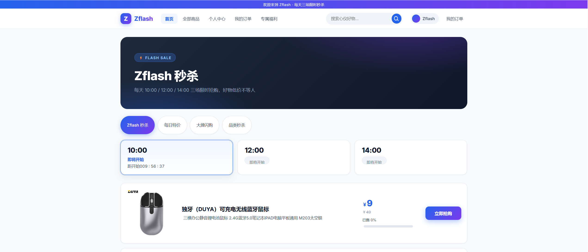
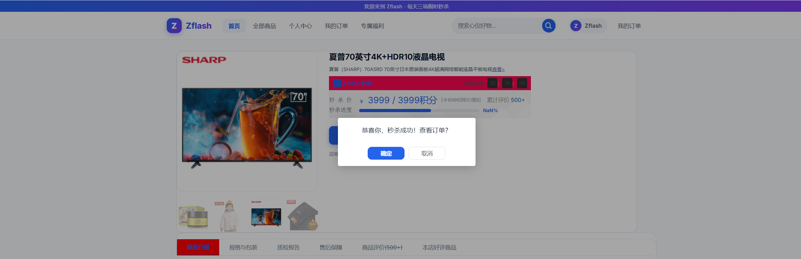
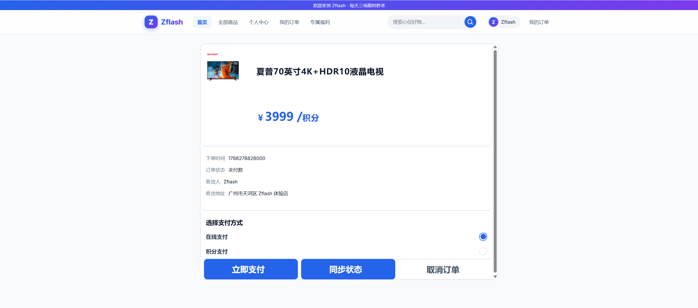
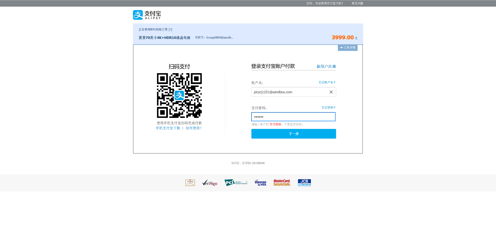
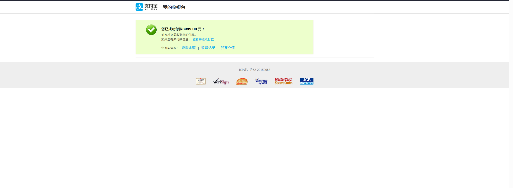

# Zflash 电商秒杀系统

基于 **Spring Cloud Alibaba** 的全栈微服务架构电商秒杀项目，基于 **Redis、RocketMQ、Seata** 等中间件实现库存超卖控制和分布式事务一致性保证。

## 项目介绍

面对秒杀场景下瞬时高并发请求、库存竞争、订单超时、跨服务数据一致性等核心难题，本项目采用微服务架构将用户认证、商品、秒杀、支付、订单等业务拆分为独立服务，通过网关统一暴露，并借助 Redis 分布式锁 + 库存预扣减、RocketMQ 异步消息与事务消息、Seata-AT、Canal + Elastic-Job 缓存同步与预热等手段，构建了一套高吞吐、数据一致、用户体验良好的秒杀系统。

前端页面基于 React（重构自原 jQuery 版本，函数签名与业务逻辑保持一致），配合 WebSocket 实现秒杀结果实时推送。

## 技术栈

| 层次 | 技术 |
|---|---|
| 微服务框架 | Spring Cloud Alibaba、Nacos（注册/配置中心）、OpenFeign、Spring Cloud Gateway |
| 缓存与锁 | Redis、Redisson WatchDog 分布式锁、库存预扣减 |
| 消息队列 | RocketMQ（异步秒杀、延迟消息、事务消息） |
| 分布式事务 | RocketMQ 事务消息、Seata-AT 模式（双方案） |
| 数据同步/定时任务 | Canal（binlog 监听同步缓存）、Elastic-Job + Zookeeper（缓存预热） |
| 支付 | 支付宝支付/退款 SDK（沙箱环境）、幂等性处理 |
| 存储 | MySQL、Redis |
| 前端 | React 18 + Vite、WebSocket、layui 样式 |
| 测试 | JMeter 压测 |

## 模块结构

```
shop-flashsale
├── frontend-server                 # 前端静态资源服务（React，端口 80）
│   └── react                       # React 工程源码（pnpm dev / pnpm build）
└── shop-parent                     # 后端微服务父工程
    ├── api-gateway                 # API 网关（统一入口、鉴权）
    ├── shop-uaa                    # 用户认证服务（/uaa/token 登录签发）
    ├── shop-provider               # 业务服务
    │   ├── product-server          # 商品服务
    │   ├── seckill-server          # 秒杀/订单核心服务
    │   ├── pay-server              # 支付宝支付/退款服务
    │   ├── intergral-server        # 积分服务
    │   └── job-server              # Elastic-Job 定时任务（缓存预热）
    ├── shop-provider-api           # Feign 接口定义
    ├── shop-common                 # 公共依赖与工具
    ├── canal-client                # Canal 客户端（订单缓存同步）
    └── websocket-server            # WebSocket 推送服务
```

## 核心设计与实现

### 1. 库存超卖控制（吞吐量提升 62%）

设计实现秒杀接口，通过多级防护彻底解决库存超卖：

- **Redis 分布式锁**：使用 Redisson WatchDog 看门狗机制续期，避免锁过期误删与业务执行超时导致的并发问题
- **Redis 库存预扣减**：秒杀请求先在 Redis 中完成库存预扣减，命中后才落库，大幅降低 MySQL 请求数
- **JMeter 压测验证**：对比纯数据库扣减方案，吞吐量提升 **62%**

### 2. 订单消息异步推送（降低 RT）

- 秒杀请求通过 **RocketMQ 异步发起**，接口快速返回“抢购中”，避免同步落库阻塞
- 服务端处理完成后通过 **WebSocket 消息推送** 将秒杀结果实时送达前端，降低接口 RT、优化抢购体验

### 3. 超时订单处理

- 使用 **RocketMQ 延迟消息**，下单后投递延迟队列
- 到期仍未支付的订单由 `TimeoutOrderMessageListener` 消费，自动取消订单并回滚 Redis/MySQL 库存

### 4. 支付宝支付/退款 SDK 接入

- 接入支付宝**付款与退款 SDK**，使用支付宝沙箱完成支付功能测试
- 支付表单由后端生成、前端注入并自动提交跳转收银台
- 对付款、退款、同步状态等操作做**幂等性处理**，防止重复支付/重复退款

### 5. 分布式事务一致性（双方案）

- **方案一：RocketMQ 事务消息** —— 秒杀本地事务与消息发送原子提交，配合 `CancelLocalSignMessageListener`、`IntegralRefundTXMsgListener` 等消费者完成积分退款、本地取消标记等补偿逻辑
- **方案二：Seata-AT 模式** —— 跨服务（秒杀/商品/积分/支付）操作通过 AT 模式自动补偿，保证最终一致性

### 6. 订单缓存同步与预热

- **Canal** 实时监控 MySQL binlog 写操作（`canal-client` 模块），订单变更即时同步更新至 Redis
- **Elastic-Job + Zookeeper**（`job-server`）在每场秒杀开始前执行缓存预热，将秒杀商品/库存提前加载入 Redis，降低秒杀瞬时查询压力

## 结果展示

### 秒杀首页（场次倒计时 + 商品列表）



### 秒杀商品详情（价格/进度/立即抢购）



### 订单详情（支付方式选择/订单状态）



### 支付宝沙箱收银台



### 支付成功



## 环境搭建与运行

### 1. 导入项目

使用 git clone 将项目导入本地，通过 IDEA 打开 `frontend-server` 与 `shop-parent`。

### 2. 初始化数据库

导入 `shop-parent/配置文件/SQL脚本` 下的脚本：

```sql
shop-intergral.sql
shop-product.sql
shop-seckill.sql
shop-uaa.sql
```

### 3. 安装并启动中间件

项目依赖 **RocketMQ、Redis、Nacos、Zookeeper**（Canal、Seata 按需启动），确保启动后 `jps` 可见相关进程。

### 4. 导入 Nacos 配置

在 `shop-parent/配置文件/nacos配置` 中找到 `nacos_config.zip`，访问 Nacos 控制台导入配置信息。

### 5. 修改配置

- `rocketmq-config-dev.yaml`：RocketMQ 地址
- `redis-config-dev.yaml`：Redis 地址
- `job-service-dev.yaml`：Zookeeper 地址
- `nacos-discovery-config-dev.yaml`：Nacos 地址

各服务 `bootstrap.yml` 中的地址也需同步修改。

### 6. 启动后端服务

按顺序启动：Nacos → 中间件 → api-gateway → shop-uaa → product-server → seckill-server → pay-server → intergral-server → job-server → websocket-server → canal-client。

### 7. 启动前端

前端已构建到 `frontend-server/src/main/resources/static`：

```powershell
cd frontend-server
mvn spring-boot:run
```

访问 http://localhost/index.html（后端网关默认 9000 端口）。

如需二次开发前端：

```powershell
cd frontend-server/react
pnpm install
pnpm dev      # 开发热更新 http://localhost:5173
pnpm build    # 构建到 static 目录
```
